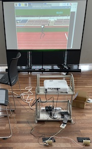

# 赤外光 足踏み ゲーム

赤外センサを用いた 足踏み ゲームです

ラズベリーパイ4(ラズパイ4)、光センサ、マイコンで作ることができます。 
ラズパイ4一式は約1万円、光センサは千五百円程度です。

[部品リスト](./docs/partslist.md)

[回路概要](./docs/circuitoverview.md)

[seeeduino-xiao用ソース](./xiao/irsens/irsens.ino)

[ラズパイ用pythonスクリプト](./raspberrypi/irspr/irspr.py)

